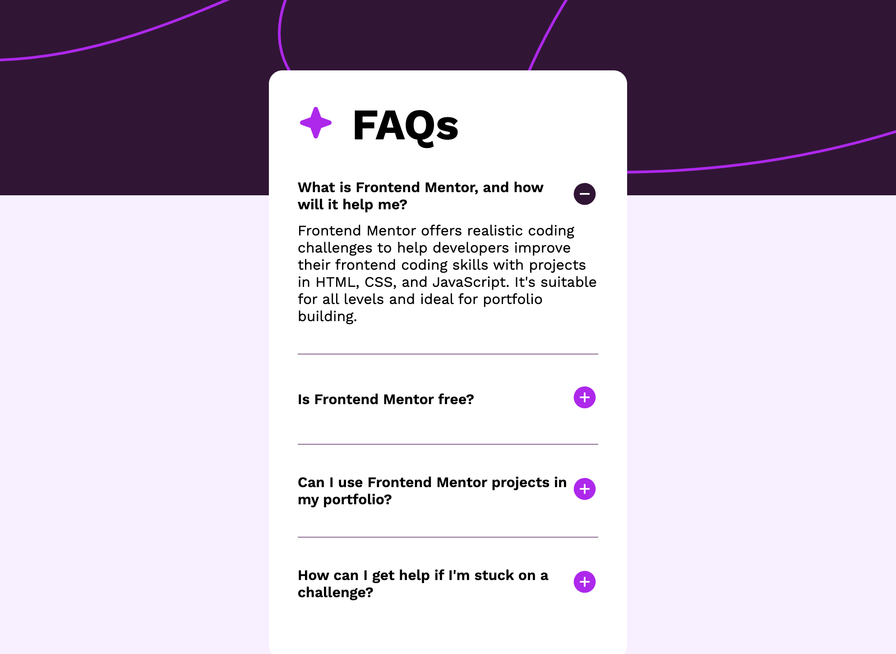

# Frontend Mentor - FAQ accordion solution

This is a solution to the [FAQ accordion challenge on Frontend Mentor](https://www.frontendmentor.io/challenges/faq-accordion-wyfFdeBwBz). Frontend Mentor challenges help you improve your coding skills by building realistic projects. 

## Table of contents

- [Overview](#overview)
  - [The challenge](#the-challenge)
  - [Screenshot](#screenshot)
  - [Links](#links)
- [My process](#my-process)
  - [Built with](#built-with)
  - [What I learned](#what-i-learned)
  - [Continued development](#continued-development)
  - [Useful resources](#useful-resources)
- [Author](#author)


## Overview

### The challenge

Users should be able to:

- Hide/Show the answer to a question when the question is clicked
- Navigate the questions and hide/show answers using keyboard navigation alone
- View the optimal layout for the interface depending on their device's screen size
- See hover and focus states for all interactive elements on the page

### Screenshot




### Links

- Solution URL: (https://github.com/Chenxi96/FAQAccordion)
- Live Site URL: (https://timely-beijinho-b0943f.netlify.app/)

## My process

### Built with

- Semantic HTML5 markup
- CSS custom properties
- Flexbox
- Javascript DOM


### What I learned

I've implemented javascript to this challenge to develop a interactive accordian FAQ

See below:

```html
<section id="first" class="first">
      <h2>
        What is Frontend Mentor, and how will it help me?
        <span>
          
        </span>
      </h2>
      <p id="firstP">
        Frontend Mentor offers realistic coding challenges to help developers improve their 
        frontend coding skills with projects in HTML, CSS, and JavaScript. It's suitable for 
        all levels and ideal for portfolio building.
      </p>
    </section>
```
```css
p {
    display: none;
    margin-top: 10px;
}
```
```js
const first = document.getElementById('first');
first.addEventListener('click', showParagraph1);
function showParagraph1() {
      if(document.getElementById('firstP').style.display === 'none') {
        document.getElementById('firstP').style.display = 'block';
        document.getElementById('1').src ='/assets/images/icon-minus.svg';
      } else {
        document.getElementById('firstP').style.display = 'none';
        document.getElementById('1').src ='/assets/images/icon-plus.svg';
      }
    }
```


### Continued development

I would like to use more javascript to develop more interactive components.


### Useful resources

- [Example resource 1](https://www.w3schools.com/whatis/whatis_htmldom.asp) - This showed me how the html DOM works.
- [Example resource 2](https://www.w3schools.com/howto/howto_js_toggle_hide_show.asp) - This showed me how i can implement it in my code to make this work.

## Author

- Website - [Chenxi](https://my-portfolio-vert-xi-14.vercel.app/)
- Frontend Mentor - [@Chenxi96](https://www.frontendmentor.io/profile/Chenxi96)
- Twitter - [@Chenxi_Lin_](https://www.twitter.com/Chenxi_Lin_)

